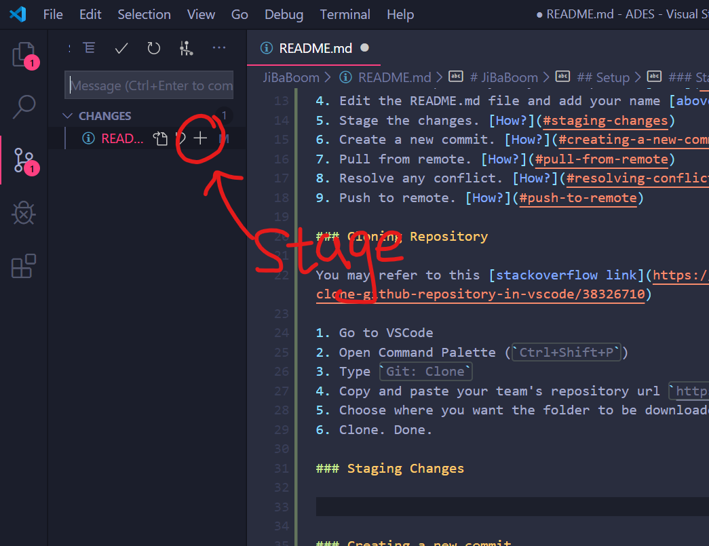

# JiBaBoom

## Names:

1. `[NAME HERE]`
2. `[NAME HERE]`

## Setup

1. Setup a Github account (Using any account)
2. Accept and access the assignment here: https://classroom.github.com/g/Vcrmt0EG
3. Clone the repository to your computer. [How?](#cloning-repository)
4. Edit the README.md file and add your name [above](#names)
5. Stage the changes. [How?](#staging-changes)
6. Create a new commit. [How?](#creating-a-new-commit)
7. Pull from remote. [How?](#pull-from-remote)
8. Resolve any conflict. [How?](#resolving-conflict)
9. Push to remote. [How?](#push-to-remote)

### Cloning Repository

You may refer to this [stackoverflow link](https://stackoverflow.com/questions/38307647/clone-github-repository-in-vscode/38326710)

1. Go to VSCode
2. Open Command Palette (`Ctrl+Shift+P`)
3. Type `Git: Clone`
4. Copy and paste your team's repository url `https://github.com/ADES-FSP/jibaboom-TEAMNAME`
5. Choose where you want the folder to be downloaded to.
6. Clone. Done.

### Staging Changes

1. Go to VSCode
2. Open Source Control (`Ctrl+Shift+G`)
3. Under `CHANGES` you should see `README.md`
4. Click the plus sign (`+`) to stage the file.
5. You see the file appear under `STAGED CHANGES`

### Creating a new commit

1. Go to VSCode
2. Open Source Control (`Ctrl+Shift+G`)
3. Add a description in the textfield
4. Click on the `...` button on the top.
5. Scroll and find `Commit Staged`
6. Click on `Commit Staged` to create a new commit.

### Pull from remote

### Resolving conflict

### Push to remote
